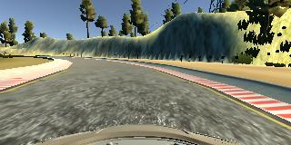

# **Behavioral Cloning** 

**Behavioral Cloning Project**

The goals / steps of this project are the following:
* Use the simulator to collect data of good driving behavior
* Build, a convolution neural network in Keras that predicts steering angles from images
* Train and validate the model with a training and validation set
* Test that the model successfully drives around track one without leaving the road
* Summarize the results with a written report


## Rubric Points
### Here I will consider the [rubric points](https://review.udacity.com/#!/rubrics/432/view) individually and describe how I addressed each point in my implementation.  

---
### Files Submitted & Code Quality

#### 1. Submission includes all required files and can be used to run the simulator in autonomous mode

My project includes the following files:
* model.py containing the script to create and train the model
* drive.py for driving the car in autonomous mode
* model.h5 containing a trained convolution neural network 
* writeup_report.md or writeup_report.pdf summarizing the results

#### 2. Submission includes functional code
Using the Udacity provided simulator and my drive.py file, the car can be driven autonomously around the track by executing 
```sh
python drive.py model.h5
```

#### 3. Submission code is usable and readable

The model.py file contains the code for training and saving the convolution neural network. The file shows the pipeline I used for training and validating the model, and it contains comments to explain how the code works.

### Model Architecture and Training Strategy

#### 1. Pre_tested Model
At first, I used LeNet as model to train. But the result was not good enough. The car would run off the road. So I decided to change anotheer model.

I selected a more powerfull model: [nVidia Autonomous Car Group](https://devblogs.nvidia.com/deep-learning-self-driving-cars/) model. Before enter data into model, I normalized the data in order to simplify caculation. Than I used keras.layers.Cropping2D to cut parts of the images, so that the trained model has less bad effection of the driving environment. 

#### 2. Final Model Architecture
At beginning, I used keras.layers.Lambda to normorlize the data, in order to simplify the caculation work. Than I took part of the images for training, which have less effect of the sky, hood and so on. The model consists of 5 convolution layers, a dropout layer, a flatten layer and 4 fully connected layers. The data of modal is :

| Layer (type)             |      Output Shape    |         Param        | 
|:------------------------:|:--------------------:|:--------------------:|
|lambda_1 (Lambda)         |   (None, 160, 320, 3)|           0          | 
|cropping2d_1 (Cropping2D) |   (None, 65, 320, 3) |           0          |
|conv2d_1 (Conv2D)         |   (None, 31, 158, 24)|          1824        |
|conv2d_2 (Conv2D)         |   (None, 14, 77, 36) |          21636       |
|conv2d_3 (Conv2D)         |   (None, 5, 37, 48)  |          43248       |
|conv2d_4 (Conv2D)         |   (None, 3, 35, 64)  |          27712       | 
|conv2d_5 (Conv2D)         |   (None, 1, 33, 64)  |          36928       | 
|dropout_1 (Dropout)       |   (None, 1, 33, 64)  |           0          |
|flatten_1 (Flatten)       |   (None, 2112)       |           0          |
|dense_1 (Dense)           |   (None, 120)        |         253560       |
|dense_2 (Dense)           |   (None, 84)         |          10164       |
|dense_3 (Dense)           |   (None, 36)         |          3060        |
|dense_4 (Dense)           |   (None, 1)          |           37         |
* Total params: 398,169
* Trainable params: 398,169
* Non-trainable params: 0

#### 3. Attempts to reduce overfitting in the model
Due to the overfitting is not obvious, I just applied 1 dropout layer after convolution layers. 

#### 4. Model parameter tuning
This model uses an Adam optimizer. The learning rate is not tuned manually. 

#### 5. Appropriate training data
Training data was produced by using the Simulator, by which my driving was recorded in images of 3 cameras in the middle,left and right of the car.
 
 


With appropriate correction: 0.25, the number of the measurement(steering angle) of both left and right images can be corrected for training. Since the training images are generated from a conterclock loop, I used cv2.flip to generate flipped images, which could make the model stable for other road environment.

#### 6. Training
By using simulator, 25398 images were generated. I used model.fit to simplify the work of generate train and validation group. Validation split(0.2) and epoch(10) were selected. Adam optimizer was also selected. Training and validation result is:


* Epoch1/10 
40636/40636 [=====================] - 56s - loss: 0.0301 - val_loss: 0.0277
* Epoch 2/10
40636/40636 [=====================] - 50s - loss: 0.0262 - val_loss: 0.0320
* Epoch 3/10
40636/40636 [=====================] - 50s - loss: 0.0242 - val_loss: 0.0308
* Epoch 4/10
40636/40636 [=====================] - 50s - loss: 0.0228 - val_loss: 0.0286
* Epoch 5/10
40636/40636 [=====================] - 50s - loss: 0.0215 - val_loss: 0.0285
* Epoch 6/10
40636/40636 [=====================] - 50s - loss: 0.0200 - val_loss: 0.0310
* Epoch 7/10
40636/40636 [=====================] - 49s - loss: 0.0190 - val_loss: 0.0310
* Epoch 8/10
40636/40636 [=====================] - 50s - loss: 0.0175 - val_loss: 0.0308
* Epoch 9/10
40636/40636 [=====================] - 50s - loss: 0.0162 - val_loss: 0.0321
* Epoch 10/10
40636/40636 [=====================] - 50s - loss: 0.0149 - val_loss: 0.0277


### Test and generate video

With drive.py, my trained model used for self_driving in the simulator. After receiving a acceptable model, the model and all the parameter were fixed. Than I used video.py to generate a mp4 file, which restored the self_driving performance of the model.

With this model, the self_driving car can run over several laps on the road. But the driving performace still can be imporved. I will try other powerful models with different parameters to continue to improve my model. 

